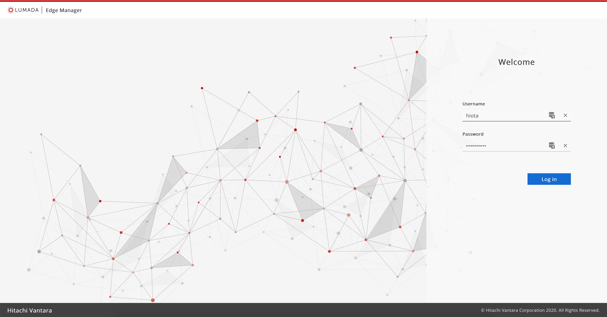
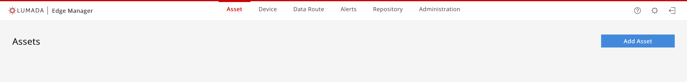
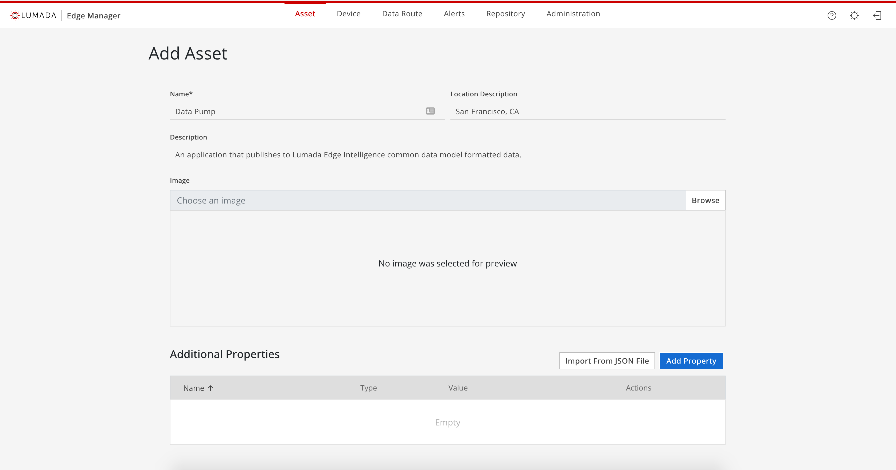
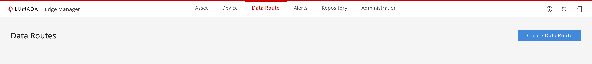
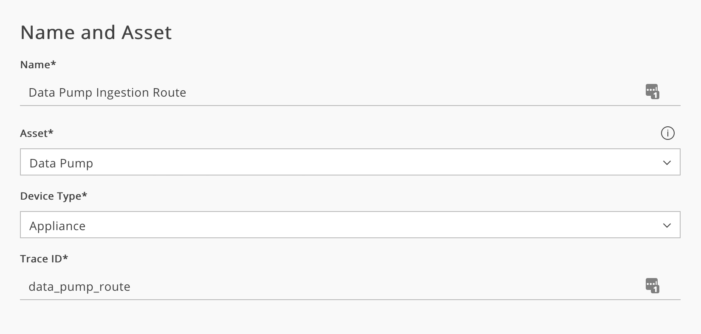
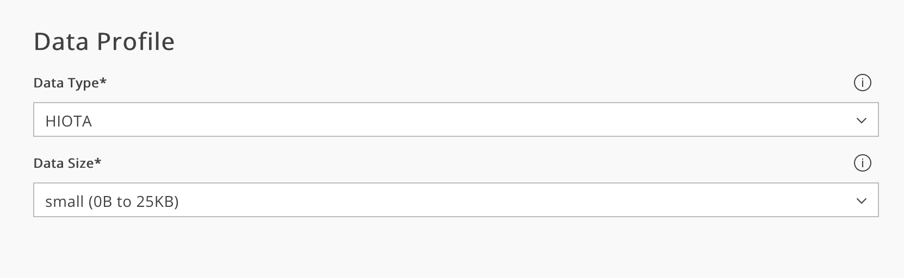
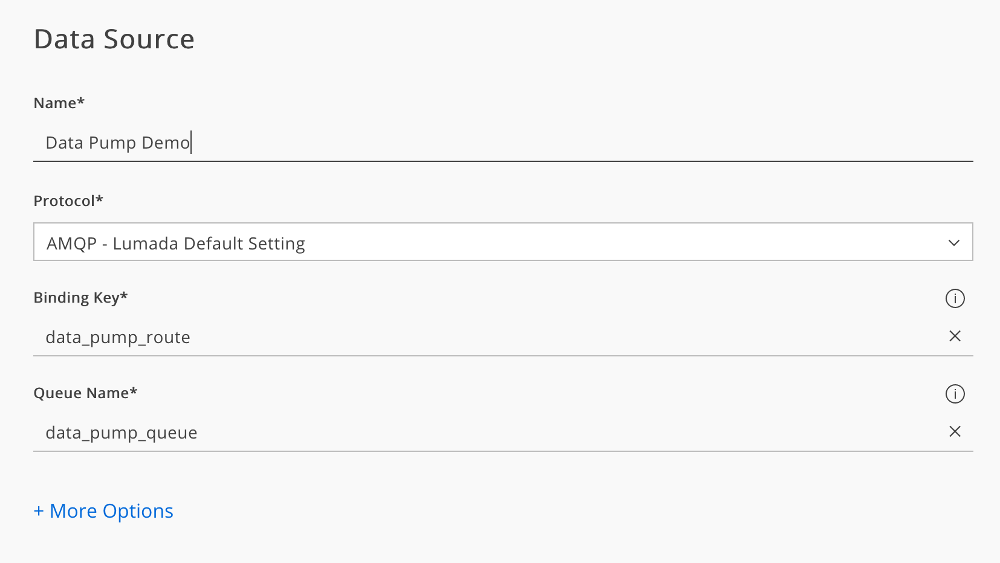
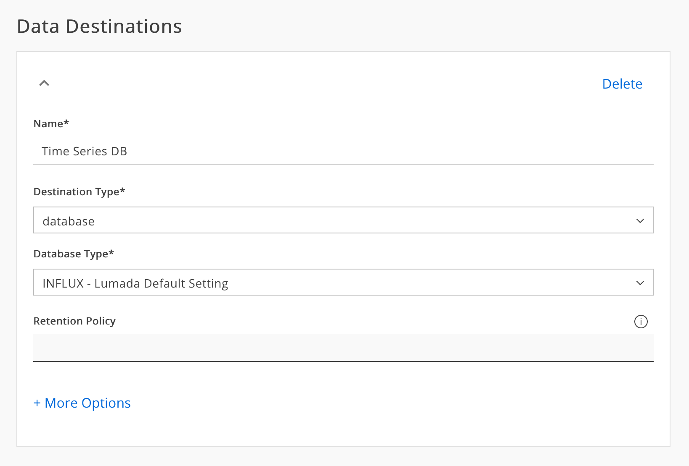

# Lumada Edge Intelligence Data Pump Demo

This document outlines the setup, use, and understanding of the Lumada Edge Data Pump. This tool is a small Python program that allows users to test routes they have set up by publish Hiota Common Data Model Messages (Protobuf messages) through. It has the added benefit of showing the common data model and how to use it.

## Application Overview

After working with this demo, you should have a better understanding of:

1. How to use the Hiota Commond Data Model
1. How to connect and publish to an application's AMQP broker

## Running the Application

### Install the Libraries

Next you will need Python libraries.

1. Run the following command

    ```bash
    pip3 install -r requirements.txt
    ```

    This might take a few minutes depending on your internet connection.

### Start the Demo

For this application to get any data into the system you will need to set up routes. Once data routes are established, this application will publish the data to the Lumada Edge Platform and that data will then be routed to the appropriate destination (data store). From there it's possible to view the data using a tool like Grafana.

#### Asset & Route Set Up

1. Log into the Lumada Edge Intelligence dashboard
    
1. Navigate to the `Asset` tab on the Lumada Edge Dashboard and select `Add Asset` located in the upper right corner
    
1. On the new screen, enter in a name for the asset. You may add additional information if you want to:
    * Add a location description (like `San Francisco, CA`)
    * Add a desciption about the device (what kind of data it might be ingesting)
    * Add an image (for reference in a room or identifiation)
    * Custom parameters (like barcode information, cpu type, memory amount, disk drive, manufacturer, etc.)
    
1. Click `Create Asset` button to comfirm the creation of the asset.
    * The system will then comfirm the successful creation of the asset.
1. Navigate to the `Data Routes` tab and select the `Create Data Route` button located in the upper right corner.
    
1. Creating the route is one on this form and is addressed in 4 unique steps. A brief explaination of the steps and information are provided here.
    * `Name and Asset` is information about the route itself.
        1. `Name` - The human readable name of the route
        1. `Asset` - The asset that is generating this information. In this case the asset we just created
        1. `Device Type` - Where the data is being streamed too. In this case the data is being streamed directly to the appliance. In other cases you might want to stream the data to a gateway device and then onto the appliance.
        1. `Trace ID` - is the key to which this data will be published to inside the AMQP broker. You may select your own key if you wish. However the default is the name of the asset + 'route'. This is sufficient for this example.
        
    * `Data Profile` - is the definition of the data.
        1. `Data Type` - is the type of data the system can expect for this route. Currently, three types are supported. `JSON`, `Influx Line Protocol`, and `Hiota` (the common data model). Since our data pump creates the common data model message, that is our selection.
        1. `Data Size` - This is a route estimate of the average size of the data being sent through the system. Several internal configurations are determined in order to optimize this such as seperate queue to process larger amounts of data as well as optimizing retries to get the data to the appropriate data store.
        
    * `Data Source` - Information about where the data comes from
        1. `Name` - Human readable name of the data source
        1. `Protocol` - How the data will come into the system. There are three options available; `REST`, `AMQP`, and `AMQP - Default Settings`. If you choose `AMQP` (without the default settings) you will need to open the other options tab and provide connection information.
        1. `Binding Key` - The binding key the data will be published to from the data source (in this case the data pump).
        1. `Queue Name` - The queue the binding key will be bound to. In almost all cases, the default binding key and queue will work. Changing the defaults is up to your user needs.
        
    * `Data Destination` - Where the data will be routed to. It's possible to route to databases, custom applications, AMQP binding keys, or a combination of all of these options; you can have multiple data destinations.
        1. `Name` - is the human readable name of the data source
        1. `Destination Type` - Currently there are two types, database and protocols. Databases supported include: `Postgres`, `Influx`, `Minio`, `Couch`. The current protocol supported is `AMQP`. If you do not choose a database or protocol with default settings, you will need to provide additional connection information (such as hostname/ip, port, usernames, etc.).
        

Your route is now set up and Lumada Edge Intelligence is ready to accept data from our data pump.

#### Setting Up Your Local Envrionment

In order for this application to work you will need to set environment variables. The following is a list of the variables and hints on what you should fill them is as.

```bash
messages_per_second = int(os.environ['DP_MESSAGE_HZ'])  # Best to pick between 1 - 100
binding_key = os.environ['DP_BINDING_KEY']              # Channel data will be posted to
trace_id = os.environ['DP_TRACE_ID']                    # ID used for routing message
exchange_name = os.environ['DP_EXCHANGE_NAME']          # The name of the exchange
rabbit_user_name = os.environ['AMQP_USERNAME']          # The username for access to AMQP
rabbit_password = os.environ['AMQP_PASSWORD']           # The password for access to AMQP
amqp_broker = os.environ['AMQP_HOSTNAME']               # The address of the AMQP broker
amqp_port = int(os.environ['AMQP_PORT'])                # The port number of the AMQP broker (this will remain the same for all lumada instances)
isDuplicated = False                                     # Tell the generator to generate duplicate data or not to
```

Recomended settings are as follows (based on the information of setting up the `Asset` and `Route` above).

```bash
export DP_MESSAGE_HZ=1
export DP_BINDING_KEY=data_pump_route
export DP_TRACE_ID=data_pump_route
export DP_EXCHANGE_NAME=hiota-exchange
export AMQP_USERNAME=<This is the username to connect to AMQP>
export AMQP_PASSWORD=<This is the password to connect to AMQP>
export AMQP_HOSTNAME=<This is the hostname / ip address to connect to AMQP>
export AMQP_PORT=30671
```

#### Run the Python Script

Running the script is the final step. To run the script, simply type:

```bash
python3 data_pump_demo.py
```

#### BONUS: Validating with Grafana

If you have an instance of Grafana, this section will show you how to view your data. Lumada Edge Intelligence offers and optional additional install for Grafana (outside of the main install). This document will not highlight how to run that installer, just how to view your data.

Programmed with :heart: by Hitachi Vantara :nerd_face: s
