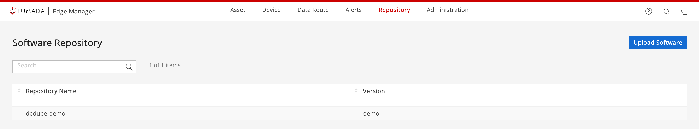
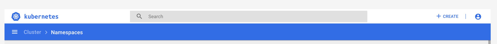
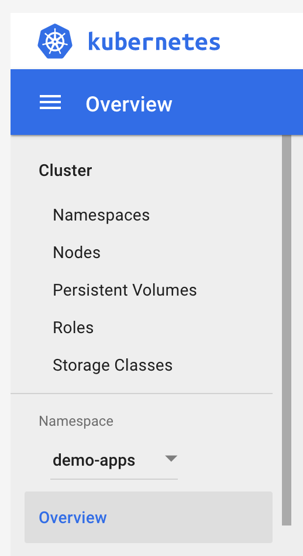

# Deduplication Analytic Demo

This demo application is a fully self contained docker application that run inside the Kubernetes cluster. This means that this project includes: code, docker files, and k8s files. The goal of this application is to show that custom analytics can be written and deployed. In this case, the analytic will remove repeated values (for example if the number 50 comes through three times in a row, only the inital 50 will be recorded). This saves disk space in the database for values that might remain the same for extended periods of time.

## Application Overview

After working with this demo, you should have a better understanding of:

1. How to write an application that can use the protobuf model
1. How to containerize and application for deployement
1. How to deploy the application to the platform and monitor it's performance

## Running the Application

Since this application is containerized, you won't need to install the libraries. Only if you wish to test this application locally would you need to install the libraries.

### Start the Demo

Since this application works in conjunction with the [Data Pump Demo](../data_pump_demo/README%20Data%20Pump%20Demo.md), it is recommended to read and have an understanding of that application. If you have already created an asset and route for that demo, you may create a new route, modify the destination of the existing route, or remove both the asset and route and start with these instructions. It's suggested that if you are still unfamiliar with how routes work, then you should delete your data pump route and asset and start with these instructions.

#### Setting Up the Asset & Routes

In this sample, two routes will need to be created. This second route is needed to connect the results of the deduplication demo app to the actual data base. The logic for this is such. The incoming data from the data pump is routed to a destination; this is the analytic. The deduplication app will perform a check on this data. If the data is a duplication, then it will not forward this on. However, if the data is not a duplicate, then the application must forward the data onward to the database, which requires a new route to get the data from the analytic to the database. Treat routes as having a source and one or many destinations. However, once data is in a destination, if it is to move onto somewhere, you will need to treat that application as another source for a new route and connect that to another destination.

For simplicity sake, the following section provides the data for creating the two routes. The Data Pump Application shows how to create routes in general and is a good starting point for a simple application.

1. `Asset`
    * `Name` - Data Pump

1. `Route 1`
    * `Name and Asset`
        * `Name` - Data Pump to Dedupe App
        * `Asset` - Data Pump
        * `Device Type` - Appliance
        * `Trace ID` - **THIS WILL BE AUTOGENERATED**
    * `Data Profile`
        * `Data Type` - Hiota
        * `Data Size` - **DEFAULT OF SMALL IS FINE**
    * `Data Source`
        * `Name` - Data Pump
        * `Protocol` - AMQP - Default Lumada Settings
        * `Binding Key` - **THIS WILL BE AUTOGENERATED**
        * `Queue Name` - **THIS WILL BE AUTOGENERATED**
    * `Data Destinations`
        * `Name` - Dedupe App
        * `Destination Type` - Protocol
        * `Protocol` - AMQP - Default Lumada Settings
        * `Binding Key` - **THIS WILL BE AUTOGENERATED**

1. `Route 2`
    * `Name and Asset`
        * `Name` - Dedupe App To Influx
        * `Asset` - Data Pump
        * `Device Type` - Appliance
        * `Trace ID` - **THIS WILL BE AUTOGENERATED**
    * `Data Profile`
        * `Data Type` - Hiota
        * `Data Size` - **DEFAULT OF SMALL IS FINE**
    * `Data Source`
        * `Name` - Dedupe App
        * `Protocol` - AMQP - Default Lumada Settings
        * `Binding Key` - **THIS WILL BE AUTOGENERATED**
        * `Queue Name` - **THIS WILL BE AUTOGENERATED**
    * `Data Destinations`
        * `Name` - Influx
        * `Destination Type` - Database
        * `Protocol` - Influx - Default Lumada Settings
        * `Binding Key` - **THIS WILL BE AUTOGENERATED**

#### Building the Container

In order to build and deploy your container, you will need to have `Docker` installed on your machine. You can find more information about how to install docker on their [site](https://www.docker.com/). Additional information about what docker is can also be found there. In brief, docker is a way to create independently packaged software that can be deployed and scaled over and over again to many servers. It's capable of leveraging certain aspects of the base operating system while remaining independent of other docker containers and the underlying OS itself.

1. If you can run the command `docker -v`, and you get back a valid response, please proceed
1. Navigate to the directory of this project `deduplication_demo`
1. In order to build the docker container, we're going to use the following command.

    ```bash
    docker build -t <Appliance / Load Balancer IP Address>:32500/dedupe-demo:demo -f Dockerfile ..
    ```

    * This will build a docker container locally (on your machine). We will move this to the Lumada Edge Intelligence platform in a few steps.
    * The `-t` command tells the docker builder what to name the image. We need it to be local host for deployment to the Docker Trusted Registry on the Lumada Edge Intelligence Appliance.
    * `-f` specifies the name of the file to build the image from

1. With the image built, we must save the image in a format for uploading. The following command will create a `.tar` file that will be accepted by the platform.

    ```bash
    docker save <Appliance / Load Balancer IP Address>:32500/dedupe-demo:demo -o dedupe-demo.tar
    ```

With the image build, we are ready to deploy. For further information about what is in the docker file please read the [About Dockerfile](#about-dockerfile) section on this README.

#### Uploading the `.tar`

Here we will cover how to properly set up the application to be deployed to the platform.

1. With the tar file just built, navigate to `Repository` tab and click the `Upload Software` button.

1. Choose the browse button and navigate to where you build the .tar file (this directory) and select the `Create` button.

1. You must wait to navigate off this upload page until a green box in the upper corner indicates that it's completed. Failing to wait may cause the upload to fail.

1. Upon completion, you should see an uploaded file on the page.


#### Deploying the Application

The next step is to deploy / run the application on the platform. This process is a two step process starting with the namespace and then the actual deployment of the application.

The namespace is place for applications to run. It is a collective of like applications sharing a logical shared spaced on the platform. If you've already run these commands with another set of demos, then you may proceed to the deployment of the application. Other wise follow these steps:

1. Navigate to the `Adminstration` tab along the top nav bar and then to the `Deployment` tab on the administration page.

1. Once there, select the `+ Create` button in the upper right corner of the dashboard.

1. Select the `Create From File` option from along the new menu.
1. Select the file from the `deployments` folder located one directory above this current documents directory

1. Select `UPLOAD`.

What's in a namespace file? If you look inside the namespace file, you'll see only 4 lines. These lines tell the platform to create a namespace called `demo-apps`. You may modify to this file to create a number of namespaces. You might find use for other namespaces for `analytics`, `bi-tools` or `ba-tools` or you might even segment off namespaces for things like `dev`, `staging`, and `prod`. The choices are your how you want to logically seperate your applications. It is strongly advised to NOT deploy applications to the following list of existing namespaces:

* `default`
* `hiota`
* `hiota-ui`
* `logging`
* `monitoring`

Once your namespace is established it's time to deploy the application. Let's configure the deployment file first. The deployment file defines how the application should run, what parameters, how much memory, what disks (volumes) should be mounted, what image to run, and a host of additional parameters. This document cannot possibly dive into all of these and futher reading is suggessted but reviewing Kubernetes deployment files [here](https://kubernetes.io/docs/concepts/workloads/controllers/deployment/). This document will review a few critical components here

* On line `8`, the namespace must match the namespace of which was just deployed, the `demo-apps` namespace.

    ```yaml
    namespace: demo-apps
    ```

* On line `19`, the image must match the image that was uploaded in the previous steps.

    ```yaml
    - image: <Appliance / Load Balancer IP>:32500/dedupe-demo:demo
    ```

* On lines `23-42`, the variables must match the variables from the routes created. If you follwed the route creation information above you may use the following pieces of information in your deployment file. You must change the `AMQP_PASSWORD` param to a valid password for the platform.

    ```yaml
    - name: DP_TRACE_ID
        value: "data_pump_1_route"
    - name: INPUT_BINDING_KEY
        value: "data_pump_destination"
    - name: INPUT_QUEUE
        value: "data_pump_destination"
    - name: OUTPUT_BINDING_KEY
        value: "data_pump_1_route"
    - name: AMQP_USERNAME
        value: "admin"
    - name: AMQP_PASSWORD
        value: !!!YOU MUST CHANGE THIS TO A VALID PASSWORD!!!
    - name: AMQP_HOSTNAME
        value: "hiota-rabbitmq.hiota"
    - name: AMQP_PORT
        value: "5671"
    - name: DEBUG_BOOLEAN
        value: "0"
    - name: EXCHANGE_NAME
        value: "hiota-exchange"
    ```

Now it's time to upload the deployment file to the platform.

1. Navigate to the `Adminstration` tab along the top nav bar and then to the `Deployment` tab on the administration page.

1. Along the left side of the dashboard, in the `namespace` field, ensure that you have selected the namespace that you have deployed. In this case the `demo-apps` namespace.

    
1. Once there, select the `+ Create` button in the upper right corner of the dashboard.

1. Select the `deduplication-demo-deployment.yaml` file from the current directory as this document.
1. Select `UPLOAD`.

You may validate your application is running and deployed with by inspecting the `Deployments` tab on along the left nav of the dashboard. You deployment should be running with a green check mark.


#### Generating Data

The next step is to send data and validate that it's processing correctly. This application depends on the [Data Pump Demo](../data_pump_demo/README%20Data%20Pump%20Demo.md), and thus uses that data pump to send data (both duplicated and non-duplicated) to the appliace to these routes.

You should follow the instructions on the data pump page for running the data pump. The following is the environment variables you should set to enable the datapump to work.

```bash
export DP_MESSAGE_HZ=1
export DP_BINDING_KEY=data_pump_route
export DP_TRACE_ID=data_pump_route
export DP_EXCHANGE_NAME=hiota-exchange
export AMQP_USERNAME=<This is the username to connect to AMQP>
export AMQP_PASSWORD=<This is the password to connect to AMQP>
export AMQP_HOSTNAME=<This is the hostname / ip address to connect to AMQP>
export AMQP_PORT=30671
```

You will also need to change the `isDuplicated` value of the data pump to `True`. This will ensure that duplicate data is generated to be filtered out by this application.

Running the script is the final step. To run the script, simply type:

```bash
python3 data_pump_demo.py
```

#### Validating the Data

The final step of this is to validate that data is indeed making it through the application. For Influx there are two ways to do this. The first is using the Lumada Edge Intelligence dashboard to verify this information. The second is through the use of Grafana. This document will not cover the use of Grafana, but simply highlight it's an available option for experienced users.

To verify that data is flowing through the system:

1. Navigate to the `Data Routes` tab.
    
1. Here the routes should say `Deployed (Connected)`.
    

### About Dockerfile

A docker file is a list of steps that are performed to generate an image that will be run inside a container. These steps help programatically build what should be included in the container from the langauges installed, to the libraries, to the source code and even environment variables and more. Each step of the build process creates a layer. This helps improve build times as well as share layers among common containers. This section will not hightlight the technology behind how docker containers behave so much as hightlight what each of the steps are in this particular file.

```bash
# Specify base container image
FROM python:3.6-slim

# Copy required files (source codes, requirements file, etc.)
COPY deduplication_demo/deduplication_demo.py /src/deduplication_demo.py
COPY deduplication_demo/requirements.txt requirements.txt
COPY protobuf_code/alert_data_pb2.py /src/

# Run required command for installing the Python libraries
RUN pip3 install -r requirements.txt

# Specify a command to exec command when container started.
CMD ["python", "-u", "./src/deduplication_demo.py"]
```

Programmed with :heart: by Hitachi Vantara :nerd_face: s