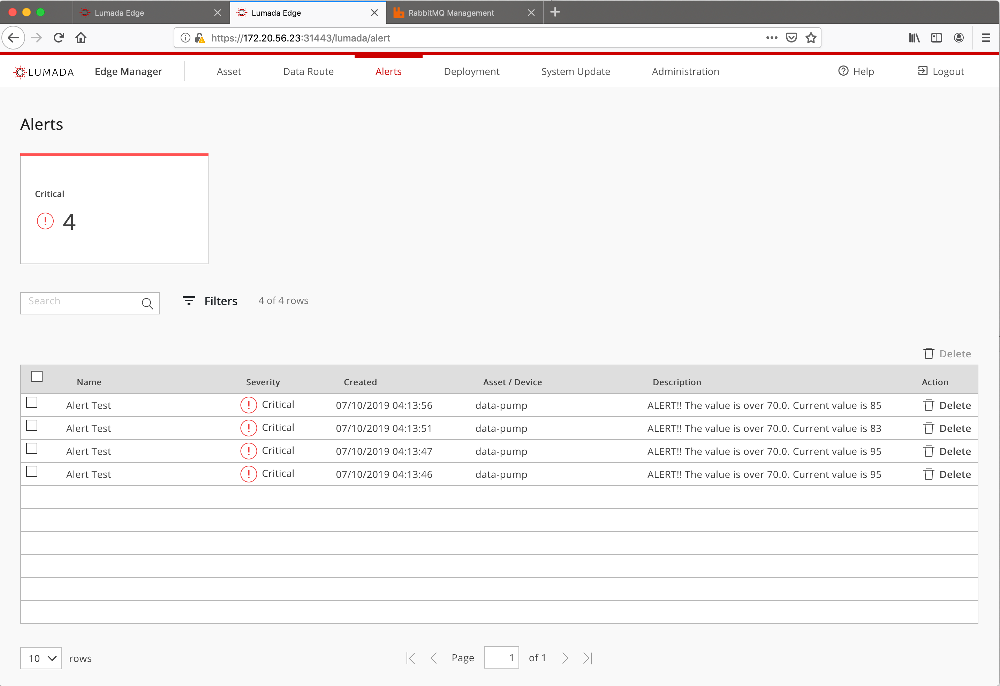
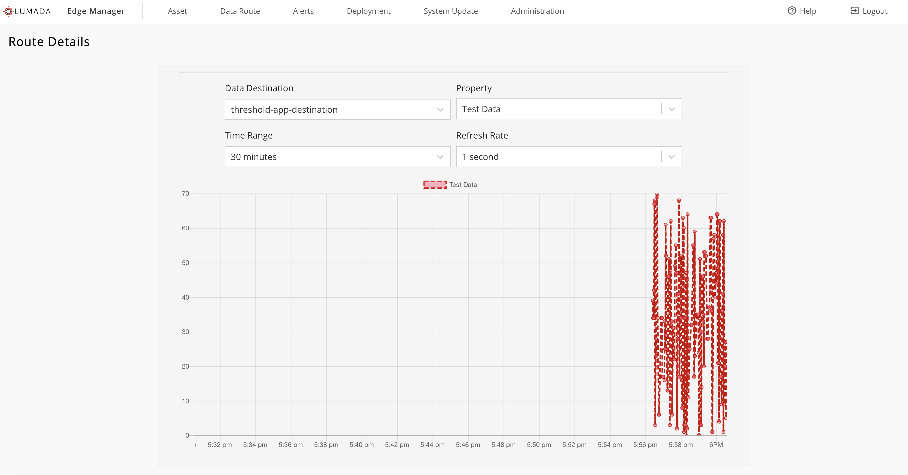
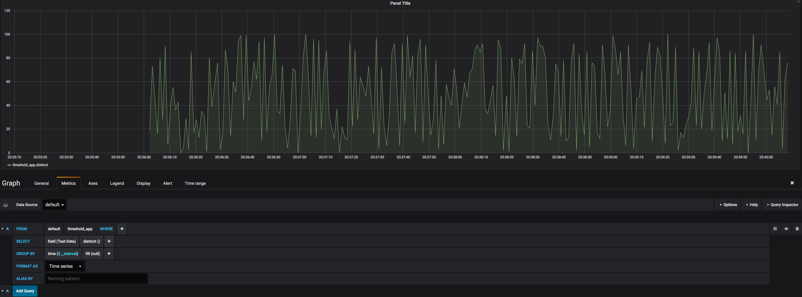

# Threshold Demo App

This demo app demostrate the following:
1. Subscribes to data that is generated from a python app (datapump.py) using Lumada Common Data Model
1. Prints an alert to the logs of the container
1. Also generates an alert on the Lumada Edge Manager Alert tab when a value goes above the set threshold in the kubernetes pod yaml file - thresholdapp-deployment.yaml.
1. Save the calculated data into Influx as Time Series Data

### Create Assets (On Lumada Edge Manager UI)

1. Create an asset for the data pump. Call the asset `data-pump`

### For the Lumada Routes (On Lumada Edge Manager UI)

These values are the default values. You can choose to change the values, but they must match in both the routes AND the container values for their respective deployment files in the `deploy` directory. The instructions below will outline the default configuration that matches the files from this repo.

1. Create Route-1 
    Subscribe the data from datapump.py and then route it Lumada AMQP Broker via AMQP
    * For the `Name and Description` section
        * Name: `Route-1`
        * Asset: `data-pump` selected from the drop down
        * Trace ID: `data-pump-amqp`
        * If the Trace ID in the route and the datapump.py environment variables, the route will fail. This is injected into the message the route will use it to propagate through the system.
    * For the `Data Profile` Section
        * Data Type: `application/x-hiota`
        * Data Size: `small (0B to 25KB)`
    * For the `Data Source` section
        * Protocol: `AMQP - Lumada Default`
        * Binding Key: `data-pump-amqp`
        * Content Type: `application/x-hiota`
        * Queue Name should match Binding Key: `data-pump-amqp`
    * For the `Data Destination` section
        * Protocol: `AMQP - Lumada Default`
        * Binding Key: `unfiltered-data`

1. Create Route-2
    Subscribed the datapump.py data, calculated the data and then route to the Lumada Influx (timeseries) database.  
    * For the `Name and Description` section
        * Name: `Route-2`
        * Asset: `data-pump` selected from the drop down
        * Trace ID: `threshold-app`
        * If the Trace ID in the route and the kubernetes file (/sample.../deploy/threshold/thresholdapp-deployment.yaml) don't match, the route will fail. This is injected into the message the route will use it to propagate through the system.
    * For the `Data Profile` Section
        * Data Type: `application/x-hiota`
        * Data Size: `small (0B to 25KB)`
    * For the `Data Source` section
        * Protocol: `AMQP - Lumada Default`
        * Binding Key: `threshold-app`
        * Queue Name should match Binding Key: `threshold-app`
    * For the `Save to Database` section
        * Database: `INFLUX - Lumada Default Setting`
        * Table should be: `threshold_app`

### For the Data Pump (Run on Local Machine)

Pre-requiste 
* Python 3

1. Get the source code
    
    ```bash
    Internal use, run the git clone command to pull the repo. External users will be provided a zipped file of the repo. 
    git clone git@10.76.48.133:pandora/shared/samples/sample-python-apps.git
    ```
    
1. Install requirements

    ```bash
    pip3 install -r requirements.txt
    ```

### Start the data pump

1. The following should be set as the environment variables for the system to work (the script reads them from the environment).
The values can be different if you selected different values when setting up routes. Please ensure that your previous selection is what is in the environment variables. `AMQP_PASSWORD` must be the one set during running application-preinstall.py and `AMQP_HOSTNAME` is the same IP address of host machine.

    ```bash
    export AMQP_USERNAME=admin
    export AMQP_PASSWORD=Change11me
    export DP_MESSAGE_HZ=1
    export DP_BINDING_KEY=data-pump-amqp
    export DP_TRACE_ID=data-pump-amqp
    export DP_EXCHANGE_NAME=hiota-exchange
    export AMQP_HOSTNAME=172.20.56.18
    export AMQP_PORT=30671
    ```

1. You should start the data pump after you have created the routes

    ```bash
    cd <project_dir>/src
    python3 datapump.py
    ```

    You may use Control+C to exit the script gracefully

### Threshold App

This is for deploying the app to the Lumada platform.

1. You will need to build the image or pull it from our repo.

    ```bash
    cd <project_dir>
    docker build -t 10.76.48.106:5000/repository/pandora/thresholdapp:1.0.0 -f build/thresholdapp/Dockerfile .
    ```
    
    **or**

    ```bash
    docker pull 10.76.48.106:5000/repository/pandora/thresholdapp:1.0.0
    ```

1. Then save the Docker image.

    ```bash
    # Save docker image to <bin_dir>,
    docker save 10.76.48.106:5000/repository/pandora/thresholdapp:1.0.0 -o thresholdapp.tar
    ```

1. Change the alert threshold and sevirity by edit `<project_dir>/deploy/thresholdapp/thresholdapp-deployment.yaml`. Explaination of some environment valuables below.
    * Parameters for route are idnetified with 'These parameters are for routes'. They must be same as those in route settings and environment for data-pump above
    * Running configurations
        
        ```bash
        # ----
        # These settigns are for app run configurations
        # ----
        
        # this is threshold value, once value get by this app, an alert with severity of ALERT_SEVERITY will be throwed to queue broker
        - name: THRESHOLD_VALUE
          value: "70.0"
        - name: AMQP_DEBUG_BOOLEAN
          value: "0"
        # don't change, same as system default exchanger name
        - name: EXCHANGE_NAME
          value: "hiota-exchange"
        # do not sent to data base if '1' otherwise will be
        - name: DISCARD_ALERT_VALUE
          value: "1"
        # save to influx if '1', otherwise not
        - name: STORE_ALERTS
          value: "1"
        # change me for different severity, 0-unknown, 1-normal, 2-warning, 3-critical
        - name: ALERT_SEVERITY
          value: "2"
        ```

1. If you built your own image, copy the image and deployment files over to the machine. The threshold and severity level are changable via the environment variable in deploy/thresholdapp/thresholdapp-deployment.yaml before deploying the pod.

    ```bash
    scp thresholdapp.tar <user>@<ip>:/<dir>
    scp <project_dir>/deploy/namespaces.yaml <user>@<ip>:/<dir>
    scp <project_dir>/deploy/thresholdapp/thresholdapp-deployment.yaml <user>@<ip>:/<dir>
    ```

1. Deploy the yaml file, again if want to change threshold and sevrity level, they are included in thresholdapp-deployment.yaml

    ```bash
    docker load -i thresholdapp.tar
    kubectl apply -f namespace.yaml
    kubectl apply -f thresholdapp-deployment.yaml
    
    # in case there is change on thresholdapp-deployment.yaml for new threshold or severity or both to make it affects running below two commands,
    kubectl delete -f thresholdapp-deployment.yaml
    kubectl apply -f thresholdapp-deployment.yaml
    ```

### For external materials, check Edge Manager UI that the data routes status are Connected.


### This is only for internal devevelopment. Verify in rabbit data is flowing.
On the queue tab, you can see several queues. After the scripts have run and routes are created you can verify the queues here. 


### Verify alert message on Lumada Edge Manager UI 

1. Log into Lumada UI `https://<machines_ip>:31443/lumada`
1. Click Alert button then all alert messages will be showed, here is an example,
   

### Verify data with Edge Manager UI


### Verify data with Grafana (optional)
Since Influx does not have a dashboard, you will need to use Grafana to view the data.

1. Log into Grafana `https://<machines_ip>:30000`
1. WHen you make a graph
    * The from should be `threshold_app` (i.e. same table as what you created in Route-2)
    * field should be `Test Data` (i.e. this is the identifier coming in with the data)
    * Next to test data, you should see a field that says `mean()`. Change that to `distinct()` from the `Aggregations` sub menu.
    * Also don't forget to change the window to the last 5 minutes with a refresh of 5 seconds (or else you're a scrub).
    
    

Programmed with :heart: by Hitachi Vantara :nerd_face: s